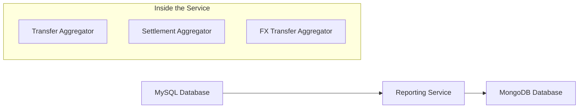
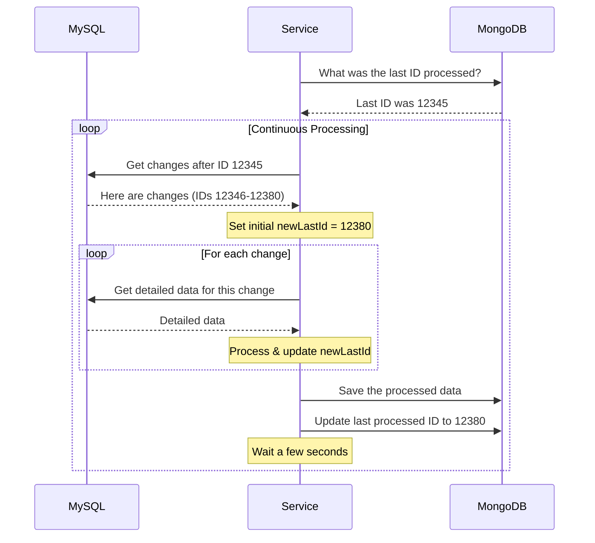

# Reporting Aggregator Service

A reporting service that aggregates transactional data from MySQL by joining multiple tables and composes denormalized records into MongoDB for efficient reporting.

## What This Service Does

The Mojaloop Reporting Aggregator Service moves data from MySQL to MongoDB to make reporting easier. It takes complex transaction data from many MySQL tables and combines it into simpler MongoDB documents that are faster to query for reports.

## Simple Architecture



## Main Components

1. **Three Aggregators**:
   - **TransferAggregator**: Moves basic transaction data
   - **SettlementAggregator**: Moves settlement information
   - **FxTransferAggregator**: Adds currency exchange details

2. **How Data Flows**:
   1. Read from MySQL
   2. Transform the data
   3. Save to MongoDB
   4. Remember progress
   5. Repeat

## How It Works



## Key Features

1. **Never Loses Track**: Updates and saves the last processed ID for each record, ensuring nothing is missed even if restarted
2. **Processes in Batches**: Handles data in manageable chunks
3. **Keeps Running**: Continues working even if some records have errors
4. **Easy to Configure**: Simple settings for database connections and processing speed

## Benefits

- **Faster Reports**: MongoDB queries run much faster than complex MySQL joins
- **Reduced Load**: Takes pressure off the main transaction database
- **Complete Data**: Captures all aspects of transactions, settlements, and currency exchanges

## Installation & Usage

### Install dependencies

```bash
npm install
```

### Build

Command to transpile TypeScript into JS:

```bash
npm run build
```

### Run

```bash
npm start
```

### Tests

```bash
npm test
```

## Documentation

For detailed documentation on each component, see the docs directory:

- [Transfer Aggregator](docs/TransferAggregator.md): Core component for processing transaction data
- [Settlement Aggregator](docs/SettlementAggregator.md): Handles settlement processing  
- [FX Transfer Aggregator](docs/FxTransferAggregator.md): Processes foreign exchange data
- [Combined Aggregators](docs/Combined-Aggregators.md): How all components work together
- [LastID Handling](docs/LastIDHandling.md): Details on how the system tracks processing state


