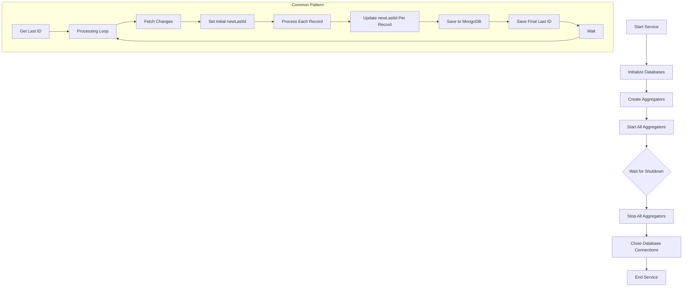

# Combined Aggregator Flow Chart

## How the Aggregators Work Together

The Mojaloop Reporting Aggregator Service runs three main aggregators:

1. **TransferAggregator**
   - Moves basic transaction data to MongoDB
   - Creates the core transaction documents

2. **SettlementAggregator**
   - Moves settlement information to MongoDB
   - Tracks how transactions are settled

3. **FxTransferAggregator**
   - Adds currency exchange details to transactions
   - Updates existing transaction records with FX data

### What They Have in Common

All three aggregators:

1. **Start and Stop Safely**
   - Check if already running
   - Clean up when stopping

2. **Remember Progress**
   - Track what's been processed
   - Resume after restarts

3. **Process in Batches**
   - Get data in chunks
   - Save many records at once

4. **Handle Problems**
   - Log errors but keep running
   - Don't lose track of progress

### How They Work as a System

1. **Data Flow**
   - Extract: Get data from MySQL
   - Transform: Convert to reporting format
   - Load: Save to MongoDB

2. **Coordination**
   - All run in parallel
   - Share database connections
   - Use common configuration

3. **Resilience**
   - Continue after errors
   - Maintain consistency
   - Clean up resources when done

This simple design creates a reliable system that continuously moves data from MySQL to MongoDB for reporting.
