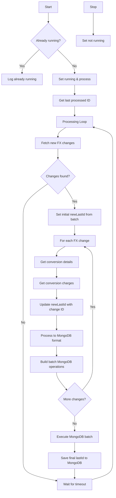

# FxTransferAggregator Flow Chart

## Process Description

The FxTransferAggregator processes foreign exchange data in these simple steps:

1. **Start/Stop**:
   - Check if already running before starting
   - Safely stop when requested

2. **Track Progress**:
   - Remember the last processed FX change ID
   - Resume from that point after restarts

3. **Main Loop**:
   - Get new FX transfer changes from MySQL
   - Collect conversion details and charges
   - Update existing transaction records with FX info
   - Update progress
   - Wait before checking for more changes

4. **Data Handling**:
   - Determine if conversion is for payer or payee
   - Add conversion details to transaction records
   - Include exchange rates, charges, and fees

This aggregator enriches transaction records with foreign exchange information from MySQL, enhancing the reporting data in MongoDB with currency conversion details. The lastId is carefully tracked and updated with each record processed, ensuring no data is missed even if the process restarts.
