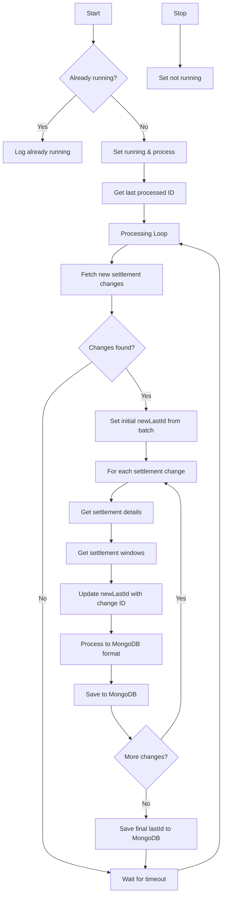

# SettlementAggregator Flow Chart

## Process Description

The SettlementAggregator processes settlements in these simple steps:

1. **Start/Stop**:
   - Check if already running before starting
   - Safely stop when requested

2. **Track Progress**:
   - Remember the last processed settlement change ID
   - Resume from that point after restarts

3. **Main Loop**:
   - Get new settlement changes from MySQL
   - Collect settlement details and windows
   - Save complete settlement records to MongoDB
   - Update progress
   - Wait before checking for more changes

4. **Data Handling**:
   - Combine settlement info from multiple MySQL tables
   - Create complete settlement records with window information
   - Store all settlement state changes

This aggregator continuously extracts settlement data from MySQL and saves it in a consolidated format in MongoDB for reporting. The lastId is carefully tracked and updated with each record processed, ensuring no data is missed even if the process restarts.
