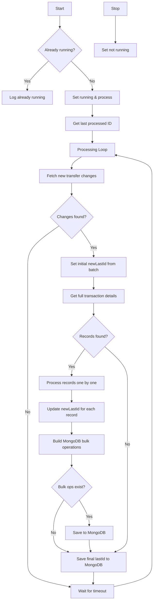

# TransferAggregator Flow Chart

## Process Description

The TransferAggregator processes transactions in these simple steps:

1. **Start/Stop**:
   - Check if already running before starting
   - Safely stop when requested

2. **Track Progress**:
   - Remember the last processed ID
   - Resume from that point after restarts

3. **Main Loop**:
   - Get new transfer data from MySQL
   - If detailed records found:
     - Transform data for reporting
     - Build MongoDB operations
     - Save to MongoDB if operations exist
   - Always update progress with new lastId
   - Wait before checking for more data

4. **Data Handling**:
   - Convert MySQL rows to MongoDB documents
   - Preserve all transaction details
   - Handle missing or invalid data

This aggregator continuously extracts transaction data from MySQL and saves it in a reporting-friendly format in MongoDB. The lastId is carefully tracked and updated with each record processed, ensuring no data is missed even if the process restarts.
